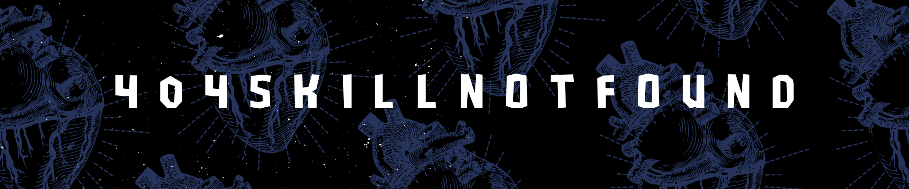

---

<table>
  <tr>
    <td valign="top" width="60%">
      <h2>About Me</h2>
      

        I focus on C++ and performance-oriented programming, with an emphasis on algorithms,
        memory management, and system-level design.
          
        This profile serves as a curated log of my projects, experiments, and ongoing technical exploration.
      

    </td>
    <td valign="top" width="40%">
      
    </td>
  </tr>
</table>

---

  <h2>My Toolkit</h2>

  <h4>Languages</h4>
  

    
    
    
  

 <h4>Tools & Platforms</h4>

  
  
  
  
  

---

  <h2>Featured Project</h2>

### 🔹 [tiny-httpserver-cpp](https://github.com/404SkillNotFound/tiny-httpserver-cpp)

A minimal HTTP server written in modern C++, built to explore low-level networking,
request parsing, and efficient I/O handling.

- Socket programming and TCP fundamentals  
- Basic HTTP request parsing  
- Minimal, readable architecture focused on learning and experimentation  

---

## GitHub Stats

## Contribution Activity

---

## Connect

